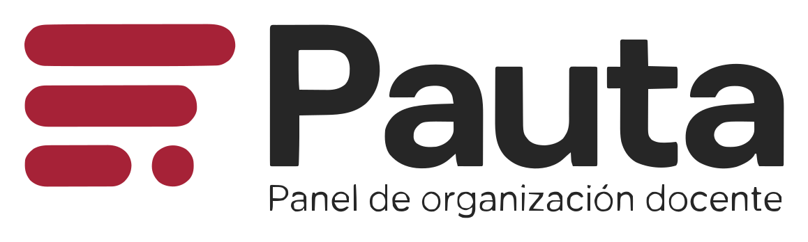
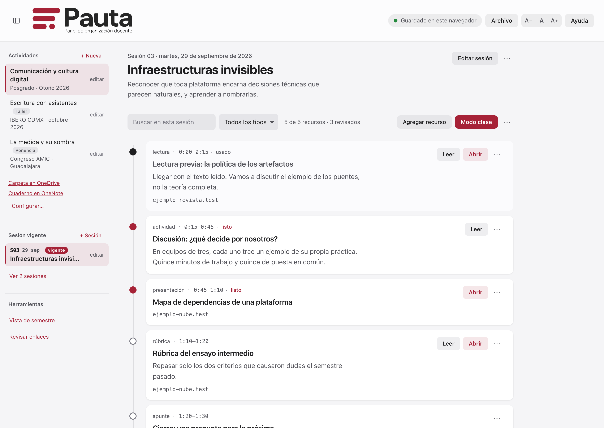
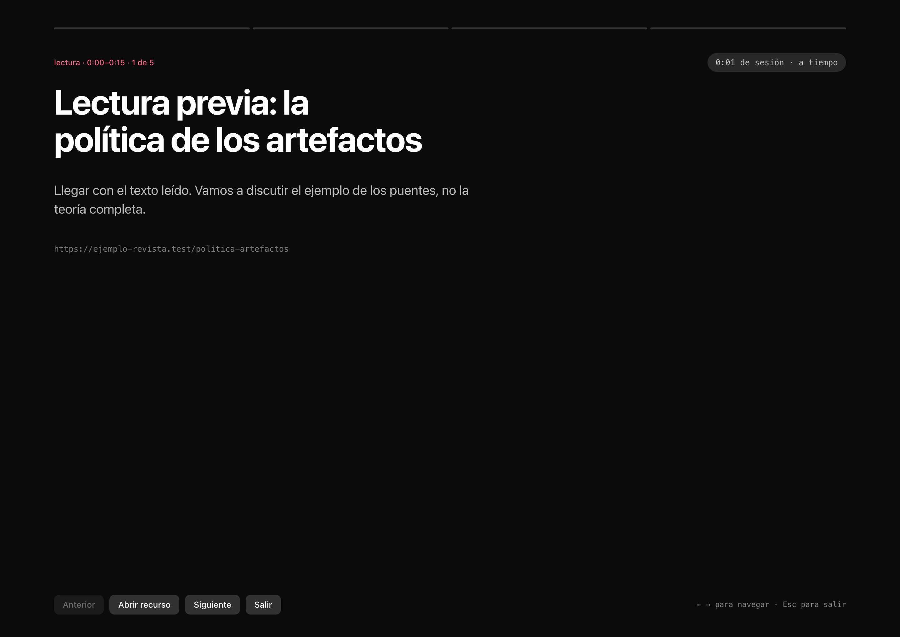

<p align="center">
  
</p>

<p align="center">
  Planea cada sesión, guarda ahí mismo las ligas que vas a usar<br>
  y preséntalas en pantalla completa el día de la clase.
</p>

<p align="center">
  <a href="https://pauta-docente.netlify.app"><strong>Abrir Pauta&nbsp;→</strong></a>
  &nbsp;&nbsp;·&nbsp;&nbsp;
  <a href="https://pauta-docente.netlify.app/ayuda">Guía de uso</a>
</p>

<br>

<p align="center">
  
</p>

<p align="center">
  <sub>Una sesión con sus recursos, ordenados por el minuto en que se usan.<br>
  Cada punto del riel dice en qué estado está: pendiente, listo o usado.</sub>
</p>

<br>

<br>

## En un minuto

No se instala nada y no hay cuentas. Es una página que abres en **Chrome o Edge**.

1. **Crea una materia.** Puede ser un curso, un taller o una ponencia: Pauta cambia las
   palabras según lo que elijas, y llamará «bloques» a los encuentros de un taller y
   «presentaciones» a los de una ponencia.
2. **Agrega sesiones.** Se ordenan solas por fecha. La que toca queda marcada como
   vigente.
3. **Cuelga los recursos** de cada sesión: una liga, una lectura, una actividad, una
   nota. Si le pones el minuto (`0:15–0:40`), se acomodan solos en ese orden.
4. **Vincula un archivo** dentro de tu carpeta de la nube. Desde ese momento tu
   planeación te sigue a cualquier computadora.
5. **El día de la clase, entra a Modo clase.** Pantalla completa, un recurso a la vez,
   flechas para avanzar y `Esc` para salir.
6. **Si das clase en Zoom, enciende «Presentación»** —el botón de al lado— y entra a
   Modo clase: la ventana aparte se abre sola con la portada de la sesión. Compartes
   esa ventana una vez, con *Compartir → Ventana*, y tus alumnos dejan de ver Pauta
   cada vez que cambias de recurso.

No hay botón de guardar: cada cambio se guarda solo.

La [guía completa](https://pauta-docente.netlify.app/ayuda) lo explica paso a paso, con
ejemplos y demostraciones.

<br>

<p align="center">
  
</p>

<p align="center">
  <sub>Modo clase: un recurso a la vez, y un reloj que compara<br>
  el tiempo transcurrido con el minuto que planeaste.</sub>
</p>

<br>

<p align="center">
  
</p>

<p align="center">
  <sub>Configurar una materia y dar clase en Zoom.<br>
  Pauta no supone ninguna nube: deduce cuál es de la liga que pegas.</sub>
</p>

<p align="center">
  <sub><em>Las capturas usan datos ficticios. La tercera es un SVG animado, sin script ni archivos externos.</em></sub>
</p>

<br>

---

## Dónde se guarda tu trabajo

Tres modos, de más a menos duradero. El indicador de la barra dice en cuál estás, y al
pulsarlo se abre el detalle.

| Modo | Qué significa |
|---|---|
| **Archivo vinculado** | Hay un `.json` tuyo en el disco y Pauta escribe ahí cada cambio, además de dejar copia en el navegador. Es el modo recomendado. |
| **Navegador** | Todo se guarda en este navegador y esta computadora. No viaja a ningún servidor, pero tampoco a tu otra máquina. |
| **Memoria** | El navegador bloqueó el almacenamiento. Pauta avisa; hay que exportar un respaldo antes de cerrar. |

**El archivo vinculado no depende de ninguna nube en particular.** Pauta usa la API
estándar del navegador y escribe en un archivo normal del disco; quien lo sincroniza es
la aplicación de escritorio de tu nube. Funciona igual con OneDrive, Google Drive,
Dropbox o iCloud, siempre que la carpeta esté **disponible sin conexión**.

**Pauta no pisa lo que escribió otra computadora.** Antes de escribir en el archivo
comprueba que sigue siendo la versión que este navegador conoce. Si otra computadora lo
cambió mientras tenías Pauta abierta, se detiene y pregunta cuál versión conservar; la
otra queda como copia de seguridad. Lo mismo al reconectar el archivo tras perder el
permiso: lo escrito sin permiso se conserva. Las versiones se reconocen por igualdad de
sello y nunca por cuál es «más reciente», así que no importa que los relojes de las
computadoras no coincidan.

Además, Pauta archiva versiones por su cuenta mientras trabajas: las **últimas seis**
para deshacer lo reciente, más **una por día de los siete días anteriores** para volver
más atrás. Se pueden restaurar desde *Archivo → Vincular archivo*.

Las copias no pueden quedarse con todo el espacio del navegador (unos cinco millones de
caracteres por sitio, y cada copia es el panel entero). Están limitadas a la mitad, y si
aun así el guardado principal no cupiera, Pauta suelta copias antes que dejar de guardar
lo que estás escribiendo, y lo avisa. Con una planeación muy grande, lo más seguro es
vincular un archivo.

---

## Instalación

Hace falta [Node.js](https://nodejs.org) 18 o más nuevo.

```bash
git clone https://github.com/tmarquez-mx/panel-de-clases.git
cd panel-de-clases
npm install
```

Para trabajar en el código, con recarga automática:

```bash
npm run dev
```

Para generar la versión final:

```bash
npm run build
```

Queda `dist/index.html`, **un solo archivo** con el CSS y el JavaScript adentro. Ese
archivo es todo lo que hay que publicar o copiar. Con `npm run preview` se revisa antes
de publicarlo.

### Dependencias

Una sola, y solo para construir: **Vite**. No hay ninguna biblioteca en la página
publicada. El empaquetado en un archivo único lo hace un plugin propio de veinte
líneas, escrito dentro de `vite.config.js`, en lugar de agregar otra dependencia.

---

## Datos y privacidad

Pauta no manda nada a ningún servidor, no tiene analítica y no pide cuentas. Lo que
escribes vive en tu navegador y, si lo vinculas, en tu archivo.

**Cuidado con los respaldos.** Las ligas de OneDrive, Drive, Dropbox o SharePoint llevan claves
de uso compartido y apuntan a una cuenta institucional: un respaldo publicado es una
llave publicada.

- El `.gitignore` excluye cualquier `.json` de datos, `datos-locales/` y `respaldos/`.
- Los datos de ejemplo del repositorio son ficticios y no tienen ninguna liga real.
- No subas tu respaldo a un repositorio abierto. Para compartir la estructura de un
  curso está **Plantilla del curso**, que exporta la materia **sin ligas y sin
  bitácoras**: quedan las sesiones, fechas, títulos, propósitos, tipos, momentos y las
  notas de uso, para que quien la reciba cuelgue sus propios archivos.
- Pauta no abre ligas con esquemas peligrosos (`javascript:`, `data:`): si un respaldo
  ajeno trae una, la muestra como texto y avisa.

### Formato del respaldo

*Guardar respaldo* descarga un `.json` con esta estructura:

```json
{
  "version": 2,
  "tipos": ["podcast"],
  "materias": [{
    "id": "artificios",
    "clase": "curso",
    "nombre": "Artificios e inteligencias",
    "clave": "Posgrado · Otoño 2026",
    "carpeta": "URL de la carpeta del curso",
    "cuaderno": "URL del cuaderno del curso",
    "ofimatica": "microsoft",
    "sesiones": [{
      "num": 3,
      "fecha": "2026-09-08",
      "titulo": "La inteligencia como categoría cargada de valor",
      "proposito": "Una o dos líneas sobre qué busca la sesión",
      "bitacora": "Texto libre",
      "recursos": [{
        "titulo": "Cave, S. (2020). The problem with intelligence",
        "tipo": "lectura",
        "momento": "0:15–0:40",
        "url": "https://…",
        "nota": "Para qué sirve este recurso en clase",
        "estado": "pendiente"
      }]
    }]
  }]
}
```

`clase` puede ser `curso`, `taller` o `ponencia`, y solo cambia el vocabulario de la
interfaz. Los respaldos anteriores, que no la traen, entran como `curso`.

`ofimatica` puede ser `microsoft`, `google` o `ninguna`, y solo decide qué botones
aparecen en «¿No existe todavía? Crear». Si falta, Pauta la deduce de la carpeta
vinculada.

*Importar respaldo* valida la estructura antes de tocar nada, dice cuántas materias y
sesiones trae y pide confirmación, porque sustituye todo. Acepta respaldos de versiones
anteriores: los campos que falten se completan con valores por omisión.

---

## Limitaciones 

- **Rutas locales (`file://`)**: no abren con un clic desde ningún navegador, por
  seguridad. Pauta las detecta y las marca; la solución de fondo es subir el archivo a
  la nube y sustituir la liga.
- **«Revisar enlaces» revisa la forma, no la existencia.** No hay ninguna petición de
  red, y por lo tanto no puede saber si un archivo existe o si tienes permiso.
- **Autenticación de la nube**: Pauta no sabe si tu sesión está abierta. Si no lo está,
  la liga te llevará a iniciarla.
- **Incrustar no siempre se puede**: OneDrive, SharePoint y muchos sitios prohíben que
  otra página los muestre dentro de un marco. Por eso Pauta abre pestañas.
- **«Abrir todo» y el bloqueador de ventanas emergentes**: la primera vez el navegador
  bloqueará las pestañas; hay que permitirlas para esa página. Lo mismo la primera vez
  que se enciende la ventana de presentación.
- **La ventana de presentación suelta `noopener`.** Reutilizar una ventana exige
  conservar su referencia, y eso permite que la página abierta alcance `window.opener`.
  Por eso nace apagada y se enciende a propósito: con el interruptor apagado, cada
  recurso se abre como siempre, en una pestaña con `noopener,noreferrer`.
- **Deshacer llega hasta la última eliminación**, no más atrás. Devuelve solo lo que se
  quitó, en su lugar, sin tocar lo escrito después.
- **La búsqueda abarca la sesión abierta**, no el curso entero. El filtro de tipos sí
  ofrece los tipos de toda la materia.
- **No hay pruebas automáticas.** Todo se verifica a mano.

---

## Estructura del código

```
index.html                  Todo el marcado de la página
vite.config.js              Configuración y el plugin de un solo archivo
netlify.toml                Construcción, el reenvío de la dirección anterior y /ayuda
assets/                     Logotipo original y capturas del README (una animada, en SVG)
public/
  ayuda.html                Guía de uso, publicada en /ayuda
  rescatar.html             Rescate de datos de la dirección anterior
  pauta-simbolo.svg         Solo el símbolo, para iconos
src/
  main.js                   Arranque: monta las vistas y conecta el guardado
  estado.js                 Qué materia y qué sesión están activas; avisa a las vistas
  historial.js              Deshacer una eliminación: repone solo lo quitado
  datos/
    modelo.js               Estructura, migración de respaldos y operaciones
    vocabulario.js          Curso, taller o ponencia: solo las palabras
    nubes.js                Qué nube es cada liga y con qué se crean los archivos
    ejemplo.js              Materias ficticias, sin ligas reales
  almacenamiento/
    gestor.js               Decide dónde se guarda y en qué modo está
    local.js                localStorage y copias de seguridad por tramos
    archivo.js              File System Access API
    manijas.js              Recuerda el archivo vinculado (IndexedDB)
  vistas/
    lateral.js              Materias, enlaces del curso, sesiones y plegado
    sesion.js               Cabecera, controles, riel de recursos y bitácora
    semestre.js             Todas las sesiones de un vistazo
    modoClase.js            Pantalla completa, un recurso a la vez, con reloj
    presentacion.js         Ventana aparte para compartir en Zoom, con su portada
    lectura.js              Tamaño del texto y vista de lectura
    menu.js                 Menús «⋯», accesibles y con teclado
    dialogos.js             Formularios de recurso, sesión, duplicar, mover y materia
    revision.js             Revisión de la forma de las ligas
    aviso.js                Aviso flotante con la acción para revertir
    mudanza.js              Aviso de cambio de dirección (temporal)
  exportacion/              Markdown, respaldo completo, plantilla y descarga
  util/                     Fechas, ligas, portapapeles y atajos del DOM
  estilos/                  base, componentes e impresión
```

Regla del proyecto: las vistas leen de `estado.js` y llaman a `actualizar()` cuando
cambian algo. `actualizar()` guarda y repinta. Ninguna vista sabe dónde se guarda ni
qué otras vistas existen.

---

## Accesibilidad

- Todo se puede usar con el teclado, y el foco siempre se ve. Los menús cierran con
  `Esc` y se recorren con las flechas.
- Ningún control aparece solo al pasar el cursor.
- **Cada control lleva su cartelito**: al pasar el cursor, cualquier botón, campo o
  menú dice qué hace. Los que cambian de comportamiento lo dicen —«Abrir» anuncia si
  va a una pestaña nueva o a la ventana de presentación—.
- El estado nunca se comunica solo con color: cambia también la palabra o la forma.
- Los tamaños de lectura se ajustan con **A− A A+** sin descuadrar la interfaz.
- En modo clase, el resto de la página queda fuera del recorrido del teclado y del
  lector de pantalla; al salir, el foco vuelve al botón de origen.
- Los formularios son `<dialog>` nativos, con etiqueta asociada en cada campo.
- Contrastes por encima de AA, y se respeta `prefers-reduced-motion`.

---

## Créditos

Diseñado por **Teresa Márquez** y desarrollado mediante vibecoding con Claude Opus 5.
Universidad Iberoamericana Ciudad de México. Agosto, 2026.

El logotipo «Secuencia» y el rojo de la pleca son identidad institucional. Quien
reutilice el proyecto en otro contexto debe cambiar la marca: la identidad gráfica de
una institución no se hereda con el código.

* README generado con Claude-Code Opus 5.5 Bajo. Contenido supervisado y editado.
